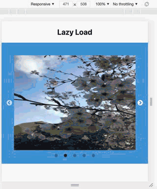
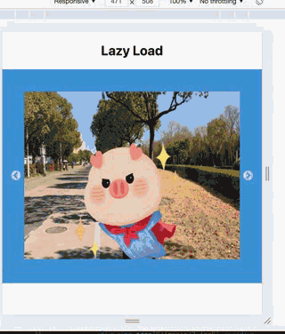

## Getting Started with Create React App

This project was bootstrapped with [Create React App](https://github.com/facebook/create-react-app).

## Available Scripts

In the project directory, you should run:
### `npm install`
then
### `npm start`

`修改了package.json的start指令，指定为Chrome浏览器自动打开` 
利用 &&功能

Runs the app in the development mode.\
Open [http://localhost:3000](http://localhost:3000) to view it in the browser.

The page will reload if you make edits.\
You will also see any lint errors in the console.

## 效果
- 多图轮播 lazyload
  </img>
- 单图循环
  - 因为这次使用create-react-app 创建单页web 还在学习react-router知识，因此使用同一个页面进行测试，在app.js中修改
 </img>
  - 另外，利用react-slick，因此单图无限循环并不显示下方dot实际上是利用两张图片假实现。对回调过程还有些迷惑。