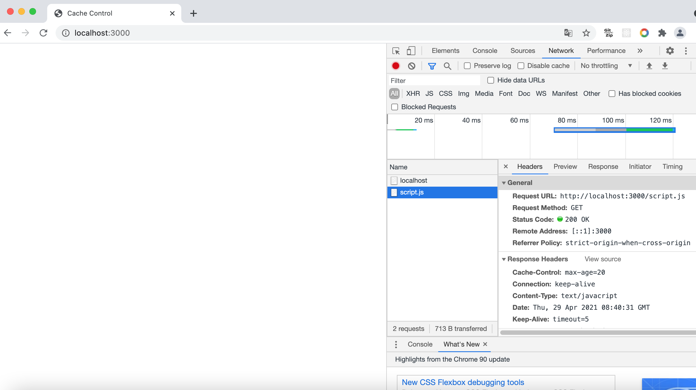
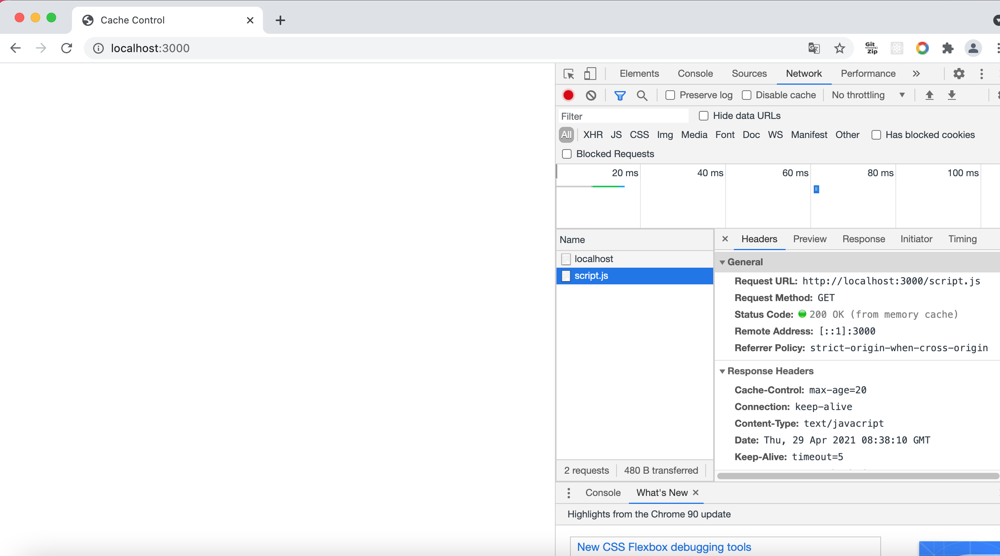
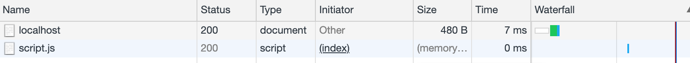
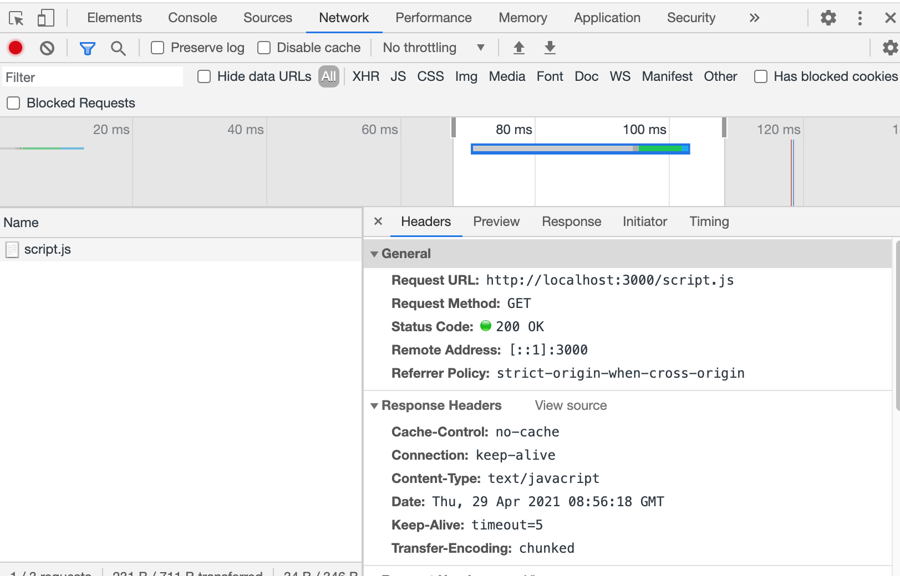
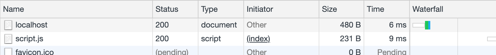

- 测试方法 node app.js
如果不行的话先进行一次npm install 虽然并不需要

- 给的是max-age=20，no-cache和no-store已注释

- max-age启用的缓存效果展示如下
  - 第一次刷新页面
  </img>
  - 20s内第二次刷新页面
  </img>
  from memory
  </img>

- no-cache效果
  </img>

- no-store效果
  </img>